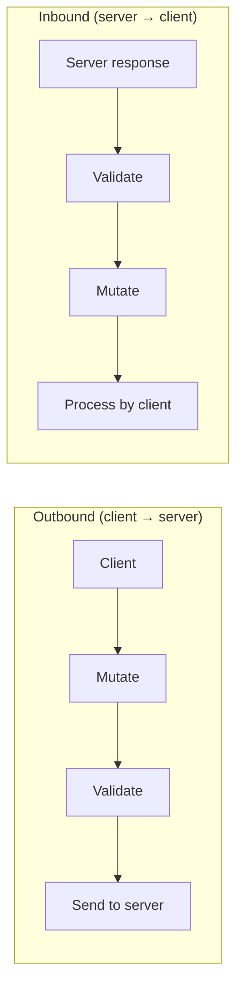

# SEP-1763 Compliance: How MCP Hangar Became an MCP-Native Interceptor

v1.1 gave you audit logs. v1.2 turns the agent into a spec-compliant interceptor that can validate, mutate, and observe MCP traffic -- with the contracts to prove it.

This release implements the P1 surface of SEP-1763: hook-based event delivery, wildcard event subscriptions, a mutator pipeline with priority ordering, and an `interceptors/list` discovery endpoint. Here is what shipped and how it maps to the spec.

## The Spec

SEP-1763 proposes a standardized interceptor framework for MCP. Originally filed as [issue 1763](https://github.com/modelcontextprotocol/modelcontextprotocol/issues/1763), the proposal was refined in [PR 2624](https://github.com/modelcontextprotocol/modelcontextprotocol/pull/2624) with a formal working group chartered in April 2026. An [experimental multi-language SDK](https://github.com/modelcontextprotocol/experimental-ext-interceptors) is under active development.

The spec evolved from a 3-type model (validation / mutation / observability) to a 2-type model: Validators and Mutators, with audit mode available on both. This is the right call -- the original three-way split was orthogonal to the actual trust boundary. Observability collapses cleanly into audit mode on the other two types, and the resulting surface is simpler to implement and reason about. The trust-boundary execution ordering is: Mutate -> Validate -> Send for outbound requests, and Validate -> Mutate -> Process for inbound responses.



MCP Hangar's agent already operated as an interceptor sidecar before the spec existed. v1.2 aligns the internals with SEP-1763 terminology and adds the missing contracts.

| SEP-1763 Concept | MCP Hangar Before v1.2 | What v1.2 Adds |
| :--- | :--- | :--- |
| Validator (enforce + audit) | Policy engine with audit/warn/block modes | Terminology alignment |
| Mutator type | Not implemented | `IMutator` contract, `MutatorPipeline`, `ResponseTruncator` |
| Hook-based event model | Flat event types in EventBus | `Hook` + `HookPhase` + `IHookSubscriber` |
| Wildcard subscriptions | Not implemented | `EventPattern` with glob matching |
| Interceptor discovery | Not implemented | `interceptors/list` HTTP endpoint |
| Trust-boundary ordering | Different rules for inbound vs outbound | Verified against spec ordering |

## Hook-Based Event Model

The new `Hook` value object wraps a domain event with a phase marker, enabling phase-aware delivery through the interceptor pipeline.

```python
class HookPhase(StrEnum):
    PRE_VALIDATE = "pre_validate"
    POST_VALIDATE = "post_validate"
    PRE_MUTATE = "pre_mutate"
    POST_MUTATE = "post_mutate"
    OBSERVE = "observe"

@dataclass(frozen=True)
class Hook:
    event: DomainEvent
    phase: HookPhase
    sequence_number: int
```

Five phases map to the SEP-1763 execution model. `sequence_number` provides a monotonically increasing counter per correlation ID for ordering guarantees.

Subscribers implement the `IHookSubscriber` protocol:

```python
@runtime_checkable
class IHookSubscriber(Protocol):
    @abstractmethod
    def on_hook(self, hook: Hook) -> None: ...
```

The `EventBus` fans out `Hook` objects to registered subscribers. Existing flat-event handlers continue to work -- the hook layer is additive, not a replacement.

## Wildcard Event Subscriptions

Policy configuration no longer requires listing every event type. The `EventPattern` value object supports glob-style matching:

```python
@dataclass(frozen=True)
class EventPattern:
    raw: str

    def matches(self, event_name: str) -> bool:
        if self._match_all:
            return True
        parts = event_name.split("/")
        if len(parts) != len(self._segments):
            return False
        return all(
            seg == "*" or seg == part
            for seg, part in zip(self._segments, parts, strict=True)
        )
```

Patterns are validated and pre-compiled at construction time. The `raw` field preserves the original text for audit logs. Supported patterns:

| Pattern | Matches |
| :--- | :--- |
| `*` | All events |
| `tools/*` | `tools/list`, `tools/call` |
| `*/request` | Any request event |
| `*/response` | Any response event |
| `tools/call` | Exact match only |

## Mutator Pipeline

The `IMutator` contract defines components that transform MCP payloads. Each mutator declares which methods it applies to and a priority hint for execution ordering.

```python
@runtime_checkable
class IMutator(Protocol):
    @property
    def priority_hint(self) -> int: ...
    @property
    def applies_to(self) -> frozenset[str]: ...
    def mutate(self, context: MutationContext) -> MutationResult: ...
```

Inputs and outputs are explicit value objects:

```python
@dataclass(frozen=True)
class MutationContext:
    method: str
    direction: Literal["request", "response"]
    payload: dict[str, Any]
    correlation_id: str

@dataclass(frozen=True)
class MutationResult:
    payload: dict[str, Any]
    changed: bool
    audit_only: bool = False
```

The `audit_only` flag supports shadow mode: compute the transformation without applying it, and log what would have changed. This is a P2 feature that the contract already supports.

The `MutatorPipeline` sorts registered mutators by `(priority_hint ascending, registration_index ascending)` and runs them sequentially. Mutators whose `applies_to` does not include the current method are skipped.

### ResponseTruncator

The first shipped mutator is `ResponseTruncator`. It prevents oversized `tools/call` response payloads from breaking LLM context windows:

```python
class ResponseTruncator:
    def __init__(self, max_bytes: int = 900_000) -> None: ...

    @property
    def priority_hint(self) -> int:
        return 1000  # runs late in the pipeline

    @property
    def applies_to(self) -> frozenset[str]:
        return frozenset({"tools/call"})
```

When truncation occurs, a `ResponseTruncated` domain event is emitted with the original size, truncated size, and threshold. The 900 KB default sits just below the per-message threshold where most production LLM context windows start aggressive truncation, leaving headroom for system prompts and prior conversation turns. Override per-deployment via the `max_bytes` constructor parameter based on your model and prompt strategy.

## Interceptor Discovery

MCP Hangar now exposes `GET /interceptors/list`, making the agent discoverable as a SEP-1763 interceptor. The response declares both validator and mutator capabilities:

```json
{
  "interceptors": [
    {
      "name": "mcp-hangar",
      "type": "validator",
      "supportedEvents": ["tools/call", "tools/list"],
      "modes": ["audit", "enforce"],
      "trustBoundary": "host"
    },
    {
      "name": "mcp-hangar",
      "type": "mutator",
      "supportedEvents": ["tools/call"],
      "modes": ["enforce"],
      "trustBoundary": "host"
    }
  ]
}
```

## What's Next

v1.2 ships the P1 surface of SEP-1763 compliance. P2 work includes:

- **Shadow mutations**: audit-only mode on mutators (compute transformations without applying them)
- **Per-interceptor `failOpen`**: granular fail-open/fail-closed policy per interceptor rule, not just agent-level
- **Extended lifecycle events**: interception of `resources/*`, `prompts/*`, `sampling/*`, and `elicitation/*`
- **PII redaction mutator**: built-in mutator for stripping sensitive data from tool payloads

The SEP-1763 successor (PR #2624) is still open. As the spec evolves, MCP Hangar will adapt. The internal abstraction layer (Hook wrapping DomainEvent) is designed for this: expose spec-compliant hooks externally while keeping internal event types for backward compatibility.

For the companion feature in this release, see [Tool Integrity for MCP: Digest Pinning in MCP Hangar v1.2](./2026-05-11-digest-pinning-sep-1766).

---

**Try it.** `pip install mcp-hangar` · [Quickstart](/docs/getting-started/quickstart) · [Helm chart](https://github.com/mcp-hangar/helm-charts)

**Discuss:** [GitHub Discussions](https://github.com/mcp-hangar/mcp-hangar/discussions)
