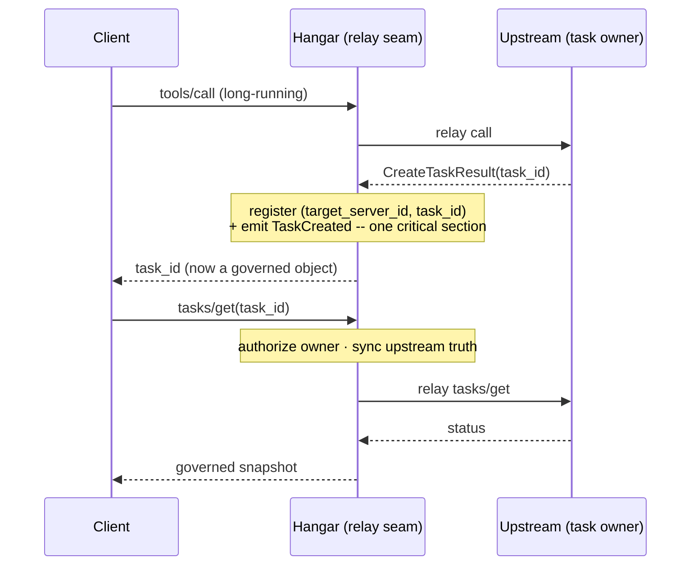

import Callout from '../../components/Callout.astro';

<Callout variant="preview">
  **Landing in 2.0.** Everything on this page describes the governed task relay
  on the **v2 preview** (`2.0.0a1`, built on `mcp==2.0.0b2`). It is **not** in
  the released `1.6.0` line. Where the text says a handler serves or a gate
  fires, read it as "on the v2 preview" -- today, released Hangar still cleanly
  rejects upstream task handles with `TaskRelayNotSupported`.
</Callout>

# Governed async tasks: relay-with-governance, not an executor

A synchronous tool call is easy to reason about: the request goes in, the result
comes back, and every layer that governed the call -- identity, digest pin,
egress policy, audit -- got its turn on the way through. The call path *is* the
governance path.

An MCP task breaks that. A `tools/call` returns almost immediately, but instead of
a result the upstream answers it with a *promise*: a `CreateTaskResult` carrying a
`task_id` and the assurance that the real work -- a long report, a multi-minute
crawl, a job that needs a human to say yes halfway through -- will finish later. The
result arrives on a `tasks/result` you make minutes or hours after the call that
started it.

That gap is where a gateway has to make a decision. It is, in our view, the most
consequential design decision in the whole tasks feature -- and the one it is
easiest to get wrong by reflex. This page is about why Hangar answers it the way
it does.

## Two wrong answers, and the one we chose

Put a proxy in front of an upstream that emits tasks and you get three options.

**Pass the handle through.** Cheapest to build: the `task_id` the upstream minted
travels back to the client untouched, and a later `tasks/get` is proxied blind.
It is also the answer that quietly breaks. The gateway has no record that the
task exists, so it cannot authorize the follow-up, cannot re-check the tool
contract the async result will be validated against, and cannot tell a client
polling a *foreign* tenant's `task_id` from one polling its own. The honest
version of pass-through is the one Hangar shipped first: refuse the handle
outright with `TaskRelayNotSupported` rather than hand back a governance-blind
promise. A clean refusal beats a dishonest relay.

**Become the executor.** The maximalist answer: the gateway creates tasks, owns
a scheduler, stores results, runs a TTL garbage collector, arbitrates
cancellation races, and bridges a worker thread back onto the main event loop.
Now the gateway *can* govern everything -- because it is now a job runner, with
every job runner's failure modes, and none of them are governance. This is a
change of *species*. A proxy that runs your jobs is not a proxy.

Hangar takes the third answer, and [ADR-014](/adr/ADR-014-tasks-relay-with-governance)
names it in the title: **relay-with-governance, not executor.** Hangar relays the
task the upstream owns, and interposes governance on its lifecycle at the same
proxy/store seam that already governs synchronous `tools/call`. It does not
create tasks. It runs no scheduler, holds no results, crosses no worker →
main-loop bridge.

The distinction is not a hedge. It is the whole thesis. Governance is worth
having precisely because it is *thin* -- it binds at the call path and nowhere
else. The moment the gateway grows an execution engine, the governance it offers
becomes contingent on that engine being correct, and "our audit trail is
trustworthy as long as our job runner has no bugs" is not a claim worth making.

## The failure mode that stops being possible

Here is the move that makes relay-with-governance more than a slogan.

The instant Hangar relays an upstream `CreateTaskResult`, and *before* the handle
reaches the client, it does two things atomically: it writes a `GovernedTaskStore`
entry keyed on the composite `(target_server_id, task_id)`, and it emits a
`TaskCreated` event onto the provenance chain. Registration and the provenance
head happen in a single lock-held critical section -- if the event publish fails,
the whole registration rolls back and *zero* governed state survives. There is no
window in which a governed task exists without a provenance head, and none in
which a handle is live but untracked.

The consequence is structural, not defensive. A relayed `task_id` is *always*
locally known. The dead-handle failure -- client holds a `task_id`, follow-up
`tasks/get` finds nothing, returns a misleading "not found" -- **cannot recur**,
because the rejection path that used to guard against it is replaced by a tracked
record. We do not test our way to this property. We removed the state in which it
could exist.



## What the ledger holds -- and what it refuses to hold

`GovernedTaskStore` is called a store, but the module's own first sentence is a
disclaimer: *Hangar does not run tasks and never holds their results.* It is a
**governance ledger**, and the line it will not cross is the reason the executor
question stays closed. Per relayed task it records exactly three things:

- the owning identity -- tenant plus principal -- bound at relay time;
- the tool **digest** pinned on the synchronous invoke path that spawned the task;
- an upstream-truth `Task` *snapshot*: status and timestamps copied **verbatim**
  from the upstream, plus Hangar's own local relay provenance.

That is the whole record. No result payload. No execution state. The `relayed_at`
timestamp is Hangar's own clock and is *never* surfaced as the upstream
`created_at` -- upstream truth is copied, not synthesized. When a client asks for
state, the snapshot is refreshed by relaying `tasks/get` to the owner and copying
the answer; an upstream error leaves the local snapshot untouched rather than
fabricating a status.

Keep that boundary in view, because it is what every other property on this page
is built on. A ledger that holds only *who*, *which contract*, and *last known
status* has taken on no execution liability. It can be authoritative about
governance precisely because it is authoritative about nothing else.

## Authorization is one chokepoint, and it does not leak

Because `task_id` is unique only per upstream -- two upstreams may legitimately
mint the same one -- every entry is keyed on the composite `(target_server_id,
task_id)`. But a client only ever sends a bare `task_id`. Resolving that to a
composite key runs through `find_owned_key`, and it is fail-closed in a specific,
deliberate way: **a `task_id` you do not own is indistinguishable from one that
does not exist.** Both return `None`; both surface as the same `INVALID_PARAMS`
"Task not found." Denial never confirms existence, so the ledger is not a
side channel for enumerating other tenants' tasks.

Every public path -- read or mutate -- runs `authorize` *first*, through a single
chokepoint that delegates to the ownership registry. An unattributed caller
(no bound identity) collapses to `TaskOwner(None, None)` and can only ever reach
unattributed entries; it can never reach a task owned by a real tenant. This is
the same shape the synchronous path uses. The async surface did not invent a new
authorization model -- it reused the one that was already load-bearing.

## The four serving handlers

On the v2 preview, a client follows up on a relayed task through four native
`tasks/*` handlers, each fail-closed and upstream-truthful:

| Handler | What it does | The governance in it |
| --- | --- | --- |
| `tasks/get` | Poll status | Authorize owner, relay to upstream, sync the snapshot from **verbatim** upstream truth. Also the synchronous consent seam (below). |
| `tasks/result` | Fetch the payload | Re-verify the **pinned tool digest** fail-closed *before* relaying; drift fails the task and raises. |
| `tasks/cancel` | Best-effort cancel | Retire the entry **only** on a confirmed upstream cancel; otherwise keep it and return the true current status. |
| `tasks/list` | Enumerate your own | Owner-scoped; the upstream cursor is never forwarded (it could identify another tenant's task), so results come back as one page. |

Two of these repay a closer look, because they are where async governance earns
its keep.

## Digest re-verification: killing the zombie

Pin a tool's digest on a synchronous call and the guarantee is clean: the result
you get was produced by the exact tool contract you authorized. Now stretch that
call across minutes. Between the `tools/call` that mints the task and its `tasks/result`, the upstream tool
can be redeployed, its schema can drift, and the async result can come back shaped
by a contract the caller never saw.

So `tasks/result` re-verifies. Before the payload is relayed, `_verify_pinned_digest`
recomputes the tool's *current* digest and compares it to the one pinned when the
task was born. On drift -- **or** when the current schema simply cannot be verified
(the safe default is to treat unverifiable as drifted) -- the task is failed, a
`DigestMismatchInTask` provenance event is emitted, and an `McpError` propagates.
The result is never handed over.

This closes what the prior ADR called the *zombie*: a task that completes against
a tool contract nobody authorized, then hands back a result that can never be
trusted and never quite dies. Digest drift **fails the task** -- it does not merely
refuse this one result. A permanently-unavailable-because-untrustworthy result is
worse than an honest failure, so we make it an honest failure.

## Consent: the one genuinely interactive gate

Some tasks pause mid-flight and ask for something -- a confirmation, a missing
parameter, a yes-or-no before they touch production. In MCP that surfaces as an
`input_required` status. This is where async governance does something the
synchronous path structurally *cannot*, and the distinction is worth stating
precisely.

**Synchronous L7 `requireApproval` fails closed.** When the enforcement plane
decides a synchronous tool call needs approval, there is no guaranteed
back-channel at the invocation instant to go find a human -- so the verdict is a
fail-closed *deny*, not a hold. It is enforcement, not a queue. The call does not
hang waiting for someone to click yes; it stops.

**The async consent gate is different, because the task is already paused.** A
task in `input_required` is, by definition, suspended and waiting -- and the
client that is polling it is right there on a live session with a negotiated
elicitation capability. That is a real back-channel. So on the 2025-11-25
session, when `tasks/get` observes `input_required`, it resolves the input *in
handler*: it elicits the downstream client for consent via `ctx.session.elicit_form`,
and only on an explicit `accept` does it open the gate and relay the answer
upstream. This is the **only** genuinely interactive consent flow in Hangar. It
routes to a real human decision because, uniquely, the context to do so exists.

Consent is obtained **before** the gate opens -- and the gate opens on nothing
else. The primitive is a presence gate with a strict rule: it is opened *only*
after a confirmed downstream `accept`, so there is no pre-decision race in which
the answer relays ahead of the human's yes.

Every other outcome is terminal and fail-closed. Walk the branches:

- **No elicitation capability negotiated.** There is no back-channel to ask, so
  the decision is a fail-closed denial before any prompt is shown.
- **The client declines or cancels.** A real *no* -- the task is failed.
- **The elicitation raises for any reason.** Any error at all is caught and
  treated as a denial. Ambiguity resolves closed, never open.
- **The consent entry was evicted** (its bounded, TTL'd slot popped under
  pressure or on expiry). The binding fails closed -- an expired or missing
  consent is never read as an implicit yes.

"Fail closed" here means one concrete thing: the task is moved to `failed` (a
best-effort `tasks/cancel` is relayed upstream), and the now-`failed` snapshot is
returned to the caller. A paused task is **never** left dangling in
`input_required` waiting on a maybe. There is exactly one exception, and it fails
in the safe direction: a *transient* upstream refusal while relaying an
already-accepted answer discards the gate **without** consuming the single-use
consent, so a retry re-elicits and completes rather than burning the task on a
blip.

And every decision -- accept or deny -- is recorded as a `TaskConsentDecided`
event on the task's provenance chain, keyed by `task_id` and attributing the
`principal_id` that was prompted. The consent gate itself stays deliberately
minimal: it decides *presence*, the ledger owns the event bus and writes the
record. Because consent is an *additive* layer -- the relay is correct without it
-- it could be built and left dormant, then wired in the moment the relay seam
went live.

That is the shape of the whole gate: a decision is taken first, the gate opens
only on an explicit yes, and every path that isn't an explicit yes terminates the
task in the safe direction and leaves a signed line in the provenance chain. It
is the one place in Hangar where governance stops and *asks* -- and even there, it
refuses to guess.

## The provenance chain closes over async

String these events together and you get the point of the whole exercise. Every
lifecycle transition of a relayed task is an append-only event keyed on `task_id`,
carrying `tenant_id` and `correlation_id`:

```
TaskCreated          # emitted at relay time, before the handle reaches the client
TaskConsentDecided   # accept / decline, with principal attribution
TaskCompleted        # working -> completed, deduped to fire exactly once
TaskFailed           # incl. digest drift, evicted binding, consent denied
TaskCancelled        # only on confirmed upstream cancel
DigestMismatchInTask # the async supply-chain event
```

Six events, and the code path emits exactly these six. ADR-014's Decision 3 also
names a `TaskInputRequired` transition in the lifecycle set, but on the v2 preview
that event is defined and metered, not emitted -- an `input_required` status is
handled inline by the consent gate above, and the decision it produces is what
lands on the chain as `TaskConsentDecided`. Every *emitted* transition of a
relayed task is on that stream, so its governed lifecycle -- who invoked it, under
which pinned contract, and how each decision resolved -- is reconstructable from
the chain. This is the same forensic non-repudiation the synchronous call path
already gives you
-- who invoked what, under which pinned contract, with what verdict -- now
extended to the one call-shape that used to be a blind spot. Async tasks were the
last governed call-shape that was dark. Relay-with-governance is what turns them
into a queryable provenance record without turning Hangar into the thing that runs
them.

## Name the liabilities we didn't take on

The most useful way to understand a design is to enumerate what it *refused*, and
ask which refusal, if reversed, changes the species. Relay-with-governance
deliberately declines all of these:

- **No scheduler.** Hangar never decides when work runs.
- **No result store.** The payload lives upstream; the ledger holds none of it.
- **No TTL / GC correctness to own.** Eviction of a still-live binding fails the
  entry *closed* (`TaskFailed('evicted')`) rather than letting it vanish silently
  -- the safe direction, and the only GC-shaped concern the ledger touches.
- **No cancellation-race ownership.** Cancel is best-effort relay; the entry
  retires only on a *confirmed* upstream cancel.
- **No worker → main-loop context bridge.** Governance binds on the request path,
  synchronously, at the proxy/store seam. There is no background execution thread,
  so the "one bug and governance silently fails to bind" failure mode is *excluded
  by construction*, not merely tested against.

Reverse any one of them and you have started building an executor. That is the
line ADR-014 draws, and the reason it draws it exactly here: a proxy can be
trusted to govern because it does so little else. The governance is credible in
proportion to how thin it is.

## What's coming, and what isn't yet

The 2026-07-28 protocol handshake and the SEP-2663 Tasks reshape change *how*
mid-flight input is resolved: the modern surface drives
an inbound `tasks/update` instead of a synchronous elicit, and `tasks/list` folds
away. The relay seam already carries a governed `tasks/update` handler, registered
only when the SDK defines its type, so the served surface tracks the negotiated
protocol without a version bump -- advertise and serve exactly what runs.

That is **forward-compatibility, not a shipped feature.** On the v2 preview today,
the synchronous 2025-11-25 consent path is the live one; the modern branch is
guarded and unreachable until the protocol lands. We mention it here because the
seam was built to absorb it, not because it is running.

And none of this reopens the executor question. When an upstream starts speaking
the new protocol, Hangar will govern more of the task's shape. It will still not
run the task. The proxy stays a proxy.

---

*Grounded in [ADR-014](/adr/ADR-014-tasks-relay-with-governance) (relay-with-governance),
building on [ADR-002](/adr/ADR-002-event-sourcing) (the provenance chain) and
[ADR-004](/adr/ADR-004-digest-pinning) (digest pinning). Everything is MIT and
self-hosted -- no SaaS.*
